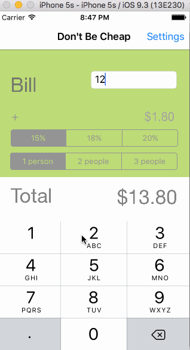

# CalcoApp

This is a Tip Calculator application for iOS submitted as the pre-assignment requirement for the CodePath application.

Time spent: ~8 hrs

Completed:

* [x] Required: User can enter a bill amount, choose a tip percentage, and see the tip and total values.
* [x] Required: Settings page to change the default tip percentage. Note that I chose to make the default only change the tip value when the app is reopened, I thought that was more natural that changing the tip amount during a current calculation.
* [X] Optional: UI changes (font size, color, etc)
* [X] Optional: Made UI changes togglea-able for accessibility purposes (now the app is accessible for color contrast impaired users!)
* [X] Optional: Offered option to split bill among multiple people
* [x] Optional: Using locale-specific currency.
* [x] Optional: Making sure the keyboard is always visible and the bill amount is always the first responder. This way the user doesn't have to tap anywhere to use this app. Just launch the app and start typing.
* [x] Optional: Added thousands separator to the total and tip (not in gif, but you can run the code and see)

This app was really fun; looking forward to learning more!

